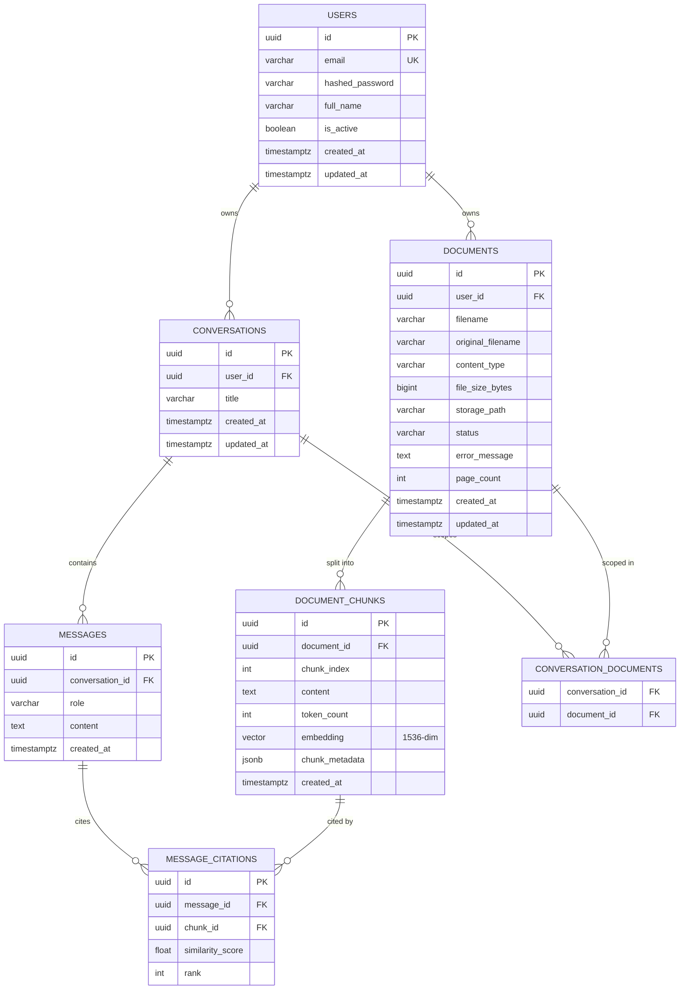

# Database Design — AI Knowledge Assistant

## 1. Engine

PostgreSQL 16 with the `pgvector` extension (`CREATE EXTENSION vector;`, applied in the first Alembic migration). Chosen over a dedicated vector database (Qdrant, Pinecone) so that relational data (users, documents, conversations) and vector data live in one transactionally-consistent store — see [TECHNOLOGIES.md](TECHNOLOGIES.md) for the full comparison. The `VectorStore` port (see [ARCHITECTURE.md](ARCHITECTURE.md)) means this can be swapped later without touching the service layer.

## 2. Entity-Relationship Diagram

## 3. Table definitions

### 3.1 `users`

| Column | Type | Constraints |
|---|---|---|
| id | UUID | PK, default `gen_random_uuid()` |
| email | VARCHAR(255) | UNIQUE, NOT NULL |
| hashed_password | VARCHAR(255) | NOT NULL (bcrypt via passlib) |
| full_name | VARCHAR(255) | NULL |
| is_active | BOOLEAN | NOT NULL, default `true` |
| created_at | TIMESTAMPTZ | NOT NULL, default `now()` |
| updated_at | TIMESTAMPTZ | NOT NULL, default `now()`, on update `now()` |

Indexes: unique index on `email` (also serves as login lookup index).

### 3.2 `documents`

| Column | Type | Constraints |
|---|---|---|
| id | UUID | PK |
| user_id | UUID | FK → `users.id`, NOT NULL, `ON DELETE CASCADE` |
| filename | VARCHAR(512) | NOT NULL (stored/sanitized name) |
| original_filename | VARCHAR(512) | NOT NULL (as uploaded, for display) |
| content_type | VARCHAR(100) | NOT NULL (`application/pdf`, `text/plain`) |
| file_size_bytes | BIGINT | NOT NULL |
| storage_path | VARCHAR(1024) | NOT NULL (local filesystem path in MVP; see §7) |
| status | VARCHAR(20) | NOT NULL, CHECK IN (`pending`,`processing`,`completed`,`failed`), default `pending` |
| error_message | TEXT | NULL |
| page_count | INT | NULL |
| created_at | TIMESTAMPTZ | NOT NULL, default `now()` |
| updated_at | TIMESTAMPTZ | NOT NULL, default `now()`, on update `now()` |

Indexes: `idx_documents_user_id` on `(user_id)`; `idx_documents_user_status` on `(user_id, status)` for the document-list-with-status query.

> Status is modeled as a `VARCHAR` with a CHECK constraint rather than a native Postgres `ENUM` so that adding a new status later (e.g. `queued`, `embedding`) is a metadata-only migration, not a type-alteration migration — a deliberate simplicity/flexibility tradeoff for a solo-maintained project.

### 3.3 `document_chunks`

| Column | Type | Constraints |
|---|---|---|
| id | UUID | PK |
| document_id | UUID | FK → `documents.id`, NOT NULL, `ON DELETE CASCADE` |
| chunk_index | INT | NOT NULL (0-based order within the document) |
| content | TEXT | NOT NULL |
| token_count | INT | NOT NULL |
| embedding | `VECTOR(1536)` | NOT NULL (pgvector type; 1536 = `text-embedding-3-small` dimensionality) |
| chunk_metadata | JSONB | NOT NULL, default `{}` (e.g. `{"page_number": 4}`) |
| created_at | TIMESTAMPTZ | NOT NULL, default `now()` |

Constraints: `UNIQUE(document_id, chunk_index)`.

Indexes:
- `idx_chunks_document_id` on `(document_id)` — used for cascade lookups and re-processing.
- **HNSW vector index**: `CREATE INDEX idx_chunks_embedding_hnsw ON document_chunks USING hnsw (embedding vector_cosine_ops);` — see §5 for the HNSW-vs-IVFFlat rationale.

### 3.4 `conversations`

| Column | Type | Constraints |
|---|---|---|
| id | UUID | PK |
| user_id | UUID | FK → `users.id`, NOT NULL, `ON DELETE CASCADE` |
| title | VARCHAR(255) | NULL (auto-derived from the first user message) |
| created_at | TIMESTAMPTZ | NOT NULL, default `now()` |
| updated_at | TIMESTAMPTZ | NOT NULL, default `now()`, on update `now()` |

Indexes: `idx_conversations_user_id` on `(user_id)`.

### 3.5 `conversation_documents` (join table)

| Column | Type | Constraints |
|---|---|---|
| conversation_id | UUID | FK → `conversations.id`, `ON DELETE CASCADE` |
| document_id | UUID | FK → `documents.id`, `ON DELETE CASCADE` |

Composite PK `(conversation_id, document_id)`. An empty set for a conversation means "search across all of the user's completed documents" (see FR-3.2 in [REQUIREMENTS.md](REQUIREMENTS.md)); a non-empty set scopes retrieval's metadata filter to those document IDs.

### 3.6 `messages`

| Column | Type | Constraints |
|---|---|---|
| id | UUID | PK |
| conversation_id | UUID | FK → `conversations.id`, NOT NULL, `ON DELETE CASCADE` |
| role | VARCHAR(20) | NOT NULL, CHECK IN (`user`,`assistant`,`system`) |
| content | TEXT | NOT NULL |
| created_at | TIMESTAMPTZ | NOT NULL, default `now()` |

Indexes: `idx_messages_conversation_id` on `(conversation_id, created_at)` — supports ordered history retrieval.

### 3.7 `message_citations`

| Column | Type | Constraints |
|---|---|---|
| id | UUID | PK |
| message_id | UUID | FK → `messages.id`, NOT NULL, `ON DELETE CASCADE` |
| chunk_id | UUID | FK → `document_chunks.id`, NOT NULL, `ON DELETE CASCADE` |
| similarity_score | FLOAT | NOT NULL |
| rank | INT | NOT NULL (1 = most relevant) |

Indexes: `idx_citations_message_id` on `(message_id)`.

Only populated for `assistant` messages. `ON DELETE CASCADE` on `chunk_id` means deleting a source document removes its citations from historical messages too — accepted as correct behavior (a citation pointing at deleted content shouldn't linger); the message `content` text itself is preserved.

## 4. Relationships summary

- `users 1—N documents`, `users 1—N conversations` (cascade delete: deleting a user removes their documents and conversations).
- `documents 1—N document_chunks` (cascade delete).
- `conversations 1—N messages` (cascade delete).
- `conversations N—M documents` via `conversation_documents` (optional retrieval scoping).
- `messages 1—N message_citations`, `document_chunks 1—N message_citations`.

## 5. Vector indexing strategy: HNSW over IVFFlat

**Decision: HNSW (`vector_cosine_ops`).**

| Factor | HNSW | IVFFlat |
|---|---|---|
| Build-time tuning | None required | Requires choosing `lists` upfront, ideally after data is loaded (`lists ≈ sqrt(rows)`) |
| Recall at fixed speed | Higher, more predictable | Lower if `lists`/`probes` are mistuned |
| Insert-time cost | Higher per-insert (graph maintenance) | Lower |
| Index build time | Higher | Lower |
| Behavior on small/growing datasets | Good — no retraining needed as data grows | Degrades if `lists` was chosen for a much smaller dataset than what it grows into |

This project has an unpredictable, incrementally-growing chunk count (users upload documents over time, one at a time) and prioritizes query recall/quality over insert throughput. IVFFlat's requirement to pick `lists` based on the eventual row count — and to rebuild the index for good recall as the table grows — is a poor fit for that access pattern. HNSW's higher per-insert cost is acceptable because ingestion is already asynchronous (§7 of [ARCHITECTURE.md](ARCHITECTURE.md)) and not on the user-facing latency path.

Index parameters: `m = 16`, `ef_construction = 64` (pgvector defaults) for the MVP; `ef_search` tuned per-query if recall issues surface in evaluation (see [EVALUATION.md](EVALUATION.md)). These are noted as tuning knobs, not re-derived from first principles, since default values are well-studied and adequate at this project's scale (expected low thousands of chunks).

## 6. Similarity metric

**Cosine distance** (`vector_cosine_ops`), matching OpenAI's embeddings, which are (approximately) unit-normalized — cosine similarity and dot product rank identically for normalized vectors, and pgvector's cosine operator avoids relying on that normalization holding exactly. Retrieval code converts pgvector's cosine *distance* (`<=>`, range [0,2]) to a similarity score (`1 - distance`) before applying the relevance threshold described in [RAG_PIPELINE.md](RAG_PIPELINE.md).

## 7. Storage of uploaded files

MVP stores uploaded files on local disk (a Docker volume mounted at `/data/uploads`, path recorded in `documents.storage_path`), keyed by `{document_id}/{sanitized_filename}`. Object storage (S3-compatible, e.g. MinIO) is deferred to post-MVP — see [ROADMAP.md §Future Improvements](ROADMAP.md) — because it adds a service to the Compose stack without changing anything about the RAG pipeline itself; the storage location is abstracted behind `DocumentService` so the migration is additive.

## 8. Migrations

Alembic manages all schema changes. The first migration:
1. Enables the `vector` extension.
2. Creates all tables in §3.
3. Creates the HNSW index from §5.

Every subsequent schema change (new column, new index) is its own migration — no manual `ALTER TABLE` against a running database, including in this project's own local dev environment.

## 9. Data isolation enforcement

Row-level `user_id` scoping is enforced in the repository layer (§2.6 of [ARCHITECTURE.md](ARCHITECTURE.md)): every repository method that reads or writes `documents`, `conversations`, `messages`, or `document_chunks` (via its parent document) takes the authenticated `user_id` and includes it in the `WHERE` clause. Postgres Row-Level Security (RLS) was considered and rejected for the MVP: RLS adds real protection against a specific threat (application-layer bugs bypassing the `WHERE` filter) but at the cost of session-variable plumbing for every DB connection; noted as a hardening option in [SECURITY.md](SECURITY.md) rather than built into the MVP.
